# ❄️ RespiGuard Snow: AI-Powered Respiratory Protection 🫁

> **Protecting lungs in extreme winter conditions using the power of Google Gemini.**


## 📖 Table of Contents
1. [Problem Statement](#-problem-statement)
2. [Solution Overview](#-solution-overview)
3. [System Architecture](#-system-architecture)
4. [Tech Stack](#-tech-stack)
5. [Deep Dive: AI & Data](#-deep-dive-ai--data)
6. [UI Showcase](#-ui-showcase)
7. [Getting Started](#-getting-started)

---

## 🏔️ Problem Statement

Winter environments pose a silent, deadly threat to millions of people worldwide. Cold air is physically denser and dryer than warm air; when inhaled, it must be rapidly warmed and humidified by the bronchial tubes. For individuals with **Asthma**, **Chronic Obstructive Pulmonary Disease (COPD)**, or **Cold-Induced Bronchospasms**, this process triggers inflammation and airway constriction.

Furthermore, snowy environments create unique atmospheric conditions:
*   **Temperature Inversions**: Cold air gets trapped near the ground, holding pollutants like car exhaust (PM2.5, NO2) and wood smoke at breathing level.
*   **Hypoxia Risks**: In high-altitude ski resorts or mountain towns, lower oxygen pressure combined with cold-induced bronchoconstriction can dangerously lower blood oxygen saturation (SpO2).
*   **Hidden Dehydration**: Cold air suppresses the thirst mechanism while the body loses water humidifying dry air, leading to thick mucus that is hard to clear.

**The Challenge**: Patients often don't realize they are in danger until it is too late. They need a system that sees the invisible threats.

---

## 🛡️ Solution Overview

**RespiGuard Snow** is a comprehensive, intelligent monitoring ecosystem designed to bridge the gap between environmental science and personal physiology. It fuses **environmental sensing** (checking the air *outside* the body) with **physiological tracking** (checking the response *inside* the body) to provide a real-time "Respiratory Risk Score".

By leveraging **Google Gemini 2.5 Flash**, the system doesn't just show numbers; it *understands* the context. It correlates a slight drop in your SpO2 with that sudden spike in PM2.5 and advises you to "Use inhaler" or "Seek shelter" before a full-blown asthma attack occurs.

### Key Features
*   **Real-time Sensor Fusion**: Merges data from temperature, humidity, particulate matter, and snow depth sensors.
*   **Biometric Feedback Loop**: Continuously watches Heart Rate, Respiratory Rate, and SpO2.
*   **AI Advisor**: Uses Large Language Models to interpret complex medical/environmental data scenarios.
*   **Predictive Alerting**: Warns users when the *trend* indicates danger, not just when the danger is already present.

---

## 🏗️ System Architecture

We utilize a modern, event-driven architecture powered by React on the frontend and Gemini on the "Edge" (browser-based inference for this demo). The system is designed for high availability and low latency.

### Diagram 1: High-Level Ecosystem 🌐

This diagram illustrates how data flows from the physical world into the digital decision engine.

```mermaid
graph TD
    subgraph "Environment Layer ❄️"
        A[Temp Sensor] -->|Bluetooth LE| Hub
        B[PM2.5 Sensor] -->|Serial/UART| Hub
        C[Snow Depth Meter] -->|Analog| Hub
    end

    subgraph "User Body Layer 🫀"
        D[Smart Watch] -->|HealthKit/API| Hub
        E[Pulse Oximeter] -->|Bluetooth| Hub
    end

    subgraph "Processing Core 🧠"
        Hub[Data Aggregator] -->|JSON Snapshot| G[React App State]
        G -->|Raw Data Context| H[Gemini 2.5 API]
        H -->|Risk Analysis| G
    end

    subgraph "User Interface 📱"
        G -->|Critical Alerts| I[Warning Banner]
        G -->|Data Trends| J[Recharts Visualization]
        G -->|AI Advice| K[Gemini Advisor Component]
    end
    
    style A fill:#e0f7fa,stroke:#006064
    style B fill:#e0f7fa,stroke:#006064
    style C fill:#e0f7fa,stroke:#006064
    style D fill:#fce4ec,stroke:#880e4f
    style E fill:#fce4ec,stroke:#880e4f
    style H fill:#f3e5f5,stroke:#4a148c
```



<details>
<summary><strong>🔍 Click to expand Architecture Details</strong></summary>

The architecture is designed for **low latency**. In a real-world deployment, the "Processing Core" would likely be a hybrid system:
1.  **Edge Layer**: Immediate alerts for simple threshold breaches (e.g., SpO2 < 90% triggers an immediate local alarm).
2.  **Cloud Layer**: Gemini Analysis for nuanced recommendations (e.g., "The humidity dropped 10% in the last hour, which might trigger your specific type of cough").
3.  **Data Lake**: Historical data is stored to retrain personalized baselines for the user.

</details>

### Diagram 2: Data Flow Pipeline 🌊

How does a sensor reading become a life-saving alert? This sequence diagram explains the loop.

```mermaid
sequenceDiagram
    participant User
    participant Sensors
    participant App
    participant Gemini as Google Gemini AI
    
    loop Every 2 Seconds
        Sensors->>App: Emit Environmental Metrics (Temp=-5°C, PM2.5=45)
        Sensors->>App: Emit Vitals (HR=110, SpO2=93%)
        App->>App: Update React State & History
        
        rect rgb(255, 240, 240)
            Note over App: Safety Check
            App->>App: Check Safety Thresholds
            opt Threshold Breached
                App-->>User: 🚨 TRIGGER CRITICAL ALERT (Visual/Haptic)
            end
        end
    end

    User->>App: Click "Analyze Risk" (or Auto-Trigger)
    App->>Gemini: Send JSON Snapshot (Env + Vitals)
    Note right of Gemini: Thinking... (Contextual Analysis)
    Gemini-->>App: Return JSON { riskLevel, summary, recommendations }
    App-->>User: Display AI Advice Card
```



### Diagram 3: Component Hierarchy & State Management 🧩

The application is built using a composable React architecture.


---

## 🧪 Tech Stack

We use a cutting-edge stack to ensure performance and reliability.


*   **Frontend Framework**: React 19 (Hooks, Functional Components, Strict Mode).
*   **Styling Engine**: Tailwind CSS (Utility-first, responsive design, beautiful typography).
*   **Data Visualization**: Recharts (Responsive SVG charts for time-series health data).
*   **AI Engine**: Google GenAI SDK (`@google/genai`) using `gemini-2.5-flash` for high-speed inference.
*   **Icons**: Lucide React (Clean, consistent iconography).

---

## 🧠 Deep Dive: AI & Data

The core differentiator of RespiGuard is the **contextual understanding** provided by LLMs. Standard rules-based systems fail to capture the nuance of "Cold but Humid" vs "Cold and Dry". A simple "If Temp < 0 then ALERT" rule is annoying; Gemini provides wisdom.

<details>
<summary><strong>🤖 View the AI Prompt Strategy</strong></summary>

We use a structured prompt to ensure valid JSON output from Gemini. The prompt includes specific constraints to ensure the advice is actionable.

```typescript
const prompt = `
  Analyze the following data from a respiratory health monitoring system...
  
  Environmental Conditions:
  - Temperature: ${temp}°C
  - PM2.5: ${pm25} µg/m³
  - Snow Depth: ${snowDepth} cm
  
  User Vitals:
  - SpO2: ${spO2}%
  - Heart Rate: ${heartRate} bpm
  
  Context: Cold air and high particulate matter...
  Provide a JSON response assessing the risk level (Low, Moderate, High, Critical).
`;
```

We mandate a specific JSON Schema in the response to ensure we can programmatically render the Risk Level badge (Green/Yellow/Red) while still displaying the natural language summary.

</details>

<details>
<summary><strong>📊 Data Simulation Logic (The Random Walk)</strong></summary>

Since we do not have physical sensors connected to this web demo, we use a **Random Walk** algorithm in `App.tsx` to simulate realistic sensor data behavior.

1.  **Temperature**: Fluctuates slowly around freezing (-5°C to 5°C), simulating a winter day.
2.  **Pollution**: Spikes randomly to simulate passing cars, snowblowers, or smoke.
3.  **Physiology**: This is the "smart" part of the simulation. If `PM2.5 > 35` or `Temp < -10`, the code artifically raises the user's Heart Rate and lowers SpO2. This allows us to demonstrate the "Critical Alert" UI without needing a real person to hyperventilate.

```typescript
// Example Logic
const stressFactor = (newPm25 > 35 || newTemp < -10) ? 1.05 : 1.0;
const newHr = Math.max(60, prev.health.heartRate + (Math.random() - 0.5) * 4 * stressFactor);
```

</details>

---

## 🎨 UI Showcase

The User Interface is built with **clarity** as the primary goal. When a user is having breathing difficulties, they cannot parse complex tables.

*   **Big Numbers**: Key metrics are huge and legible.
*   **Color Coding**: We use standard medical triage colors (Green/Yellow/Red).
*   **Animations**: Pulse animations on the "Warning" banner draw attention immediately without being induced seizures.
*   **Charts**: Area charts show the *trend*—is my oxygen getting better or worse?


*(Concept visualization)*

---

## 🚀 Getting Started

To run this application locally and start monitoring:

1.  **Clone the repository**
    ```bash
    git clone https://github.com/your-username/respiguard-snow.git
    cd respiguard-snow
    ```
2.  **Install Dependencies**
    ```bash
    npm install
    ```
3.  **Set Environment Variables**
    Create a `.env` file and add your Gemini API Key. (The app will run in "Simulation Mode" without it, but AI features will be disabled).
    ```env
    API_KEY=your_google_ai_key_here
    ```
4.  **Run Development Server**
    ```bash
    npm start
    ```
5.  **Open Browser**
    Navigate to `http://localhost:3000` to see the dashboard.

---

*Built with ❤️ for lung health. Stay warm, breathe easy.*
